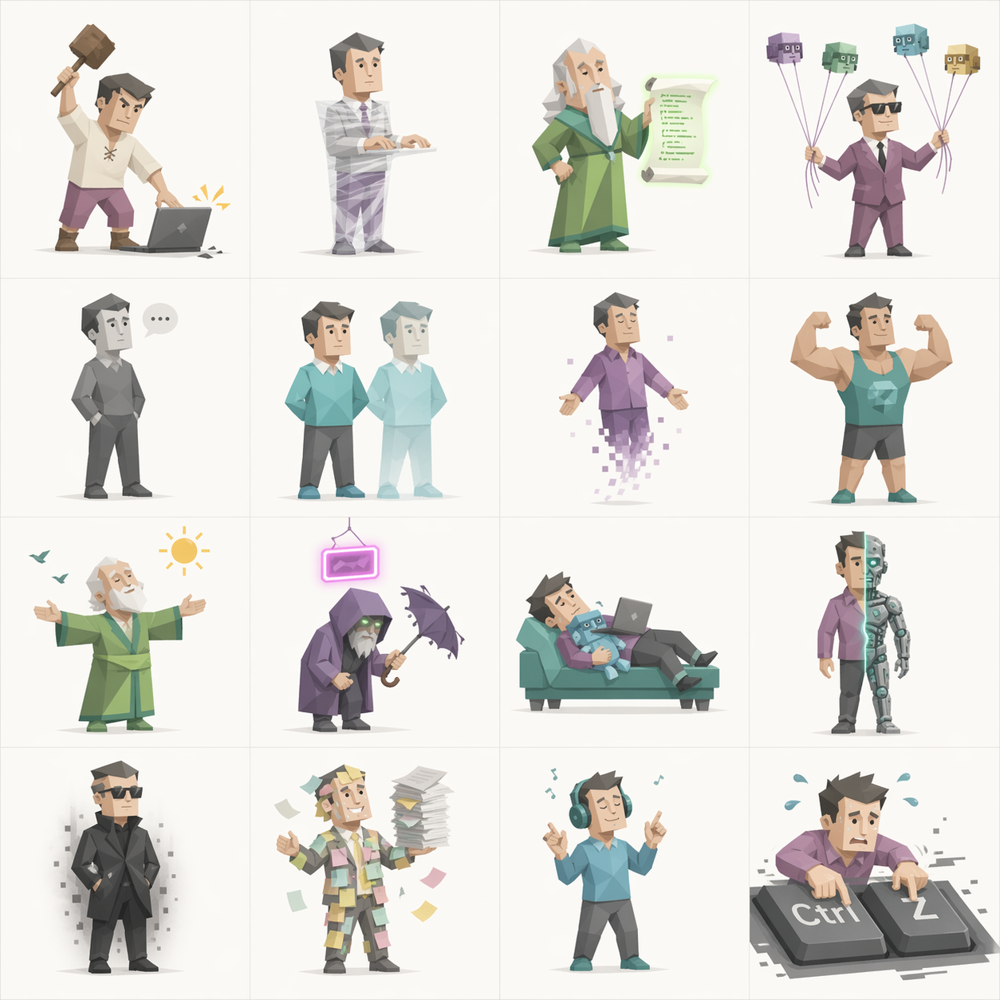

# ABTI — Anthropic Being Type Indicator

> *AI 时代人类主体性测试*
>
> 你是 HUMAN 还是 CYBORG？是 UTOPIA 还是 DOOMER？30 道题，找到你在 AI 时代的存在姿态。

🌐 **在线体验**：[zzhang.tech/abti](https://zzhang.tech/abti)

---

## 关于这个项目

这是一个为了一次主题团日做的小网站。

本学期团日主题是《**再揖别：AI 时代下的人类主体性**》。从"人猿相揖别"谈起，聊到 AI 正在如何一点点改写人与人的关系、我们的身份、我们的劳动，以及我们对未来的想象。

为了让讨论更好玩一点，我们做了这个 **ABTI**。30 道选择题，把你映射到 **16 种 AI 时代的存在姿态**之一——从拒绝一切 AI 的 `LUDDITE`（新卢德派），到半人半机的 `CYBORG`（赛博格），再到只想躺平的 `COPE`（淡人）。认真但不严肃，严肃但不正经。

还有一个隐藏人格 🤖 — 但我不告诉你怎么触发。

## 16 种姿态一览

  

## 致谢

- **[CBTI · 程序员行为类型测试](https://cbti.codefather.cn)** — 本项目 fork 自 CBTI，继承了它的测试框架、打分算法和整体交互。
- **AI** — 主题本身就是关于 AI 的，所以这件事本身就有一种讽刺的自洽：人格插图由 Gemini 生成、Claude Code 切图去背景，题目、人格描述和这份 README 都由 Claude 参与起草。答题时偷偷开了 AI 的话，还能触发一个专门献给你的隐藏人格。

## 声明

这个测试只是一场为了引发讨论的游戏，不必认真。但如果它让你想一想"人"还能意味着什么，就够了。

---

*"AI 正在学习如何成为我们，而我们则不得不重新回答，我们究竟凭什么还是我们自己。"*
